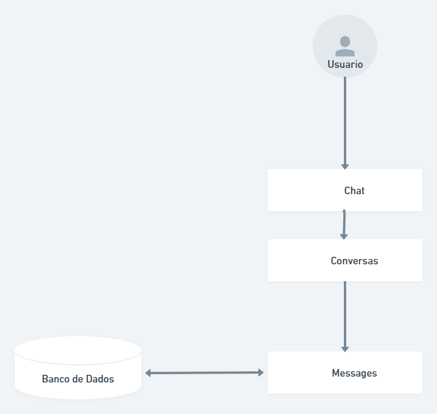

# Descrição do desafio

Desenvolver um Omnichannel.

# Features

- [x] Cadastro de Usuario
- [x] Pagina de Login
- [x] Chat

# Tecnologias

- Laravel
- Sqlite
- Pusher

 ### Pré-requisitos

Antes de começar, você vai precisar ter instalado em sua máquina as seguintes ferramentas:

[Git](https://git-scm.com), [Node](https://nodejs.org/en/). 

Além disto é bom ter um editor para trabalhar com o código como [VSCode](https://code.visualstudio.com/)

### 🎲 Rodando o Back End (servidor)

```bash
# Clone este repositório
$ git clone https://github.com/daltonfontes/BemolTest


# Vá para a pasta server
$ cd BemolTest

# Instale as dependências
$ npm install
$ composer install


# Edite os campos abaixo no seu arquivo .env para configurar a base de dados.

DB_CONNECTION=sqlite

# Edite os campos abaixo no seu arquivo .env para configurar o broadcast.

BROADCAST_DRIVER=pusher

# Criar migrations
$ php artisan migrate

# Iniciar aplicação
$ php artisan serve
# O servidor inciará na porta:8000 - acesse <http://localhost:8000>

```

### 🎲 Rodando o Front End (cliente)

```bash

# Vá para a pasta server
$ cd BemolTest

# Instale as dependências
$ npm install

# Iniciar aplicação
$ npm run dev
# O servidor inciará na porta:5173 - acesse <http://localhost:8000>

```
### C4 Model

Contexto:

A aplicação é um Chat multi canais.
O Chat tem uma área de administração que permite aos administradores gerenciar os chats.
Container:

A aplicação é executada em um servidor web que roda o PHP e o banco de dados SQLite.
O Laravel é usado como o framework PHP para o desenvolvimento da aplicação.
Componentes:

A camada de apresentação inclui as páginas do chat e as visualizações da administração, que são geradas pelo Laravel Blade.
A camada de negócios inclui os modelos de usuarios e mensagens, que são implementados como classes do Laravel Eloquent.
A camada de dados inclui o acesso ao banco de dados SQLite, que é feito através do Laravel Eloquent.

Código:

O código-fonte da aplicação é mantido no GitHub e é organizado em pastas que representam as camadas de apresentação, negócios e dados.
O código é escrito em PHP e segue as boas práticas do Laravel, como o uso de rotas, controladores e serviços.

### C4 Diagrama

<p align="center">
  
</p>